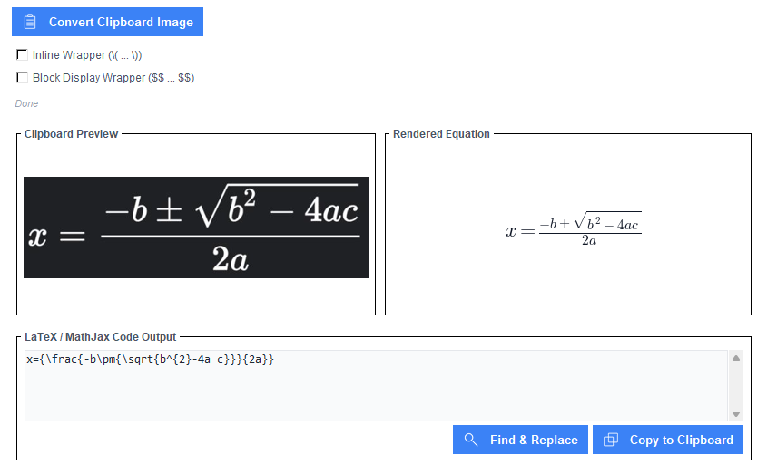

# LaTeX OCR GUI

I was tired of SimpleTex Server Peak Time restrictions, so here's an open source local alternative, though admittedly more limited and less accurate: a lightweight Tkinter GUI that converts clipboard screenshots of math equations into LaTeX code using `pix2tex` library.

> [!NOTE]
> This program, due to using `pix2tex`, only works accurately with already synthetically rendered LaTeX formulas, for examples from existing PDFs, not handwritten ones or ones using a different font.



> [!WARNING]
> **Disk Space & Initial Setup Delay**
> * **Storage Requirements:** Because this application relies on deep learning via `pix2tex`, installing the dependencies will pull down **PyTorch (`torch`)**. This will consume **between 2 GB to 4 GB of disk space** depending on your environment.
> * **First-Run:** The very first time you attempt to convert an image, the application will take a while to respond. In the background, `pix2tex` must automatically download its trained neural network weights (~1 GB) from the internet into your local user cache folder (`~/.cache/pix2tex`). Ensure you have a stable internet connection on the first run; subsequent conversions will happen entirely offline and much faster.

## Features

* **Instant Startup:** The model loads in a background thread so the UI appears immediately.
* **Clipboard Integration:** Press `Ctrl + V` to pull a formula screenshot straight from your clipboard.
* **Live Preview:** Displays a real-time mathematical render of the output via Matplotlib.
* **Formatting Wrappers:** One-click toggles for Raw, Inline `\( ... \)`, or Block Display `$$...$$` formats.
* **Find & Replace:** Built-in dialog to quickly fix minor OCR typos on the fly.

## Dependencies

Install the required libraries via pip:

```bash
pip install pix2tex pillow matplotlib
```

*Linux users may also need to install system Tkinter: `sudo apt-get install python3-tk`*

## Usage

1. Copy a formula screenshot to your clipboard.
2. Launch the script:

    ```bash
    python latex_ocr_gui.py
    ```

3. Press `Ctrl + V` anywhere in the window to convert, format, and copy your code.
